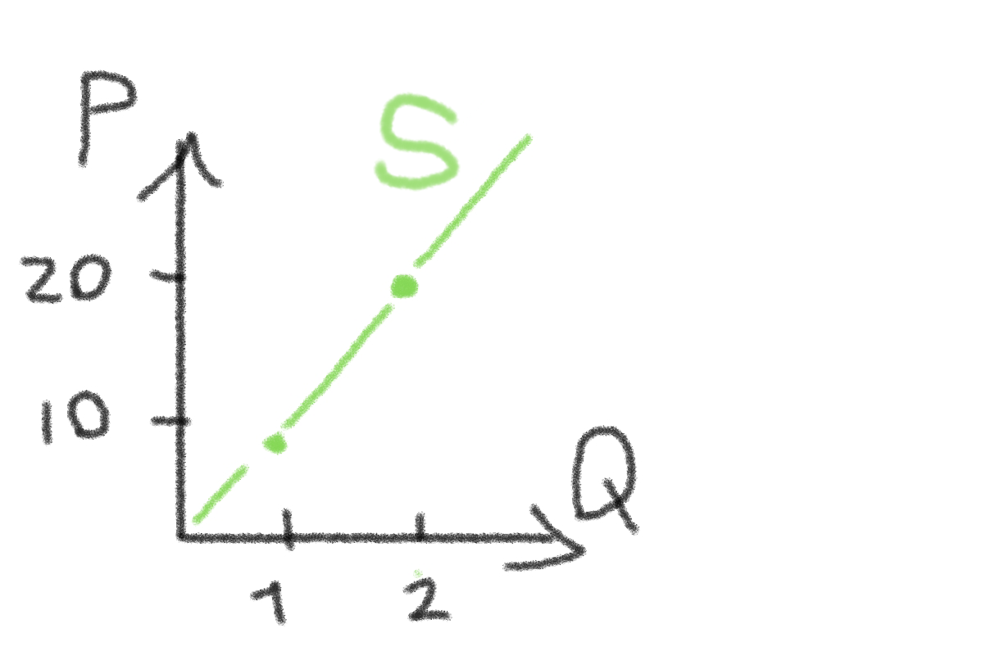
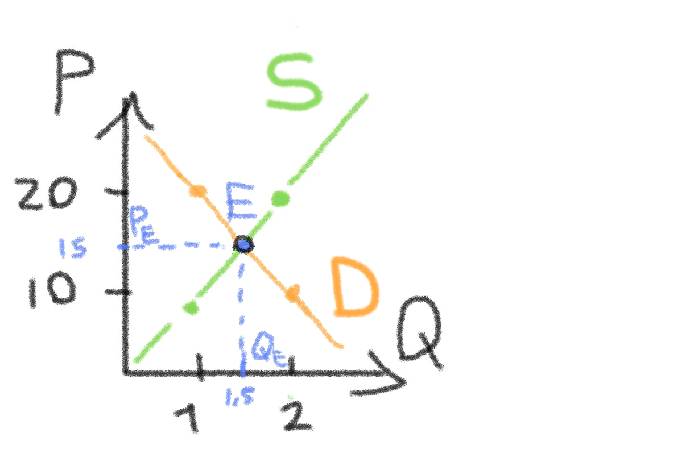
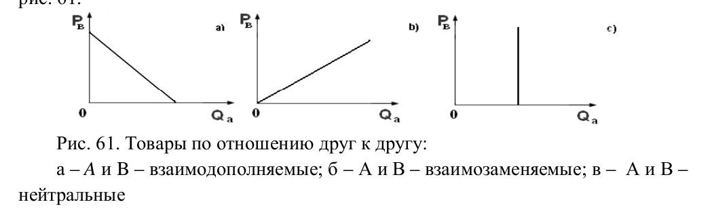
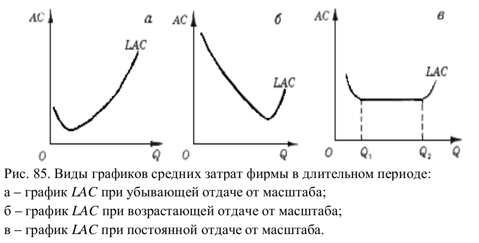
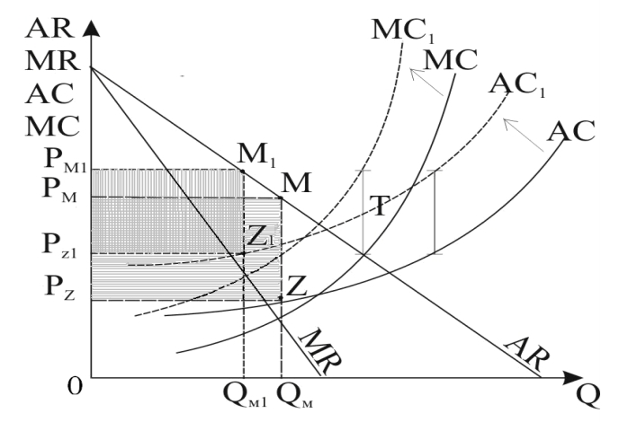
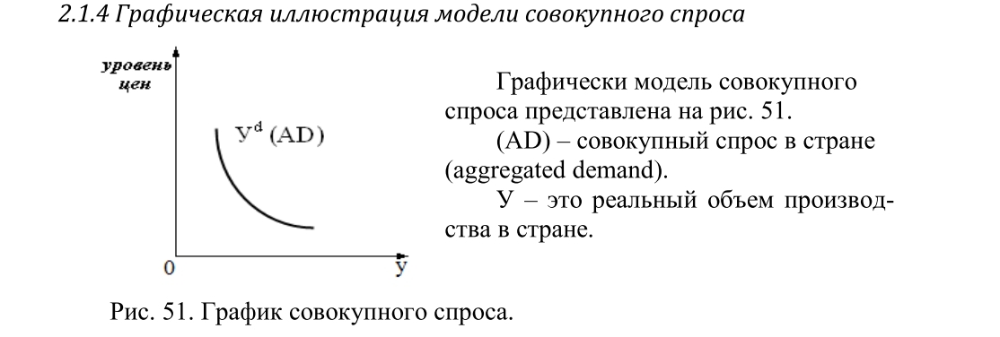

# Билеты по Экономике

0. [Краткая теория по графикам](#ticket00)
1. [Государственное регулирование рынка...](#ticket01)
1. [Кардиналистский и ординалистский подходы...](#ticket02)
1. [Коэффициенты эластичности спроса...](#ticket03)
1. [Производственная функция...](#ticket04)
1. [Затраты фирмы в коротком и длительном периодах...](#ticket05)
1. [Условия максимизации прибыли фирмы...](#ticket06)
1. [Ценовая дискриминация...](#ticket07)
1. [Регулирование естественной монополии...](#ticket08)
1. [Предельная доходность и стоимость факторов производства...](#ticket09)
1. [Рынок труда: условия найма рабочей силы...](#ticket10)
1. [Неоклассическая модель общего экономического равновесия...](#ticket11)
1. [Инструментарий кейнсианской теории...](#ticket12)
1. [Общее равновесие на рынке труда...](#ticket13)
1. [Модель Хикса-Хансена...](#ticket14)
1. [Модель совокупного спроса...](#ticket15)
1. [Классическая и неокейнсианская формулы совокупного спроса...](#ticket16)
1. [Система национального счетоводства...](#ticket17)
1. [Безработица и ее виды...](#ticket18)
1. [Двухуровневая банковская система...](#ticket19)
1. [Резервы коммерческих банков...](#ticket20)
1. [Кредитно-денежная политика государства...](#ticket21)
1. [Фискальная политика государства...](#ticket22)

[Документ в docx онлайн](https://docs.google.com/document/d/1dKYLkjc3akS3rAODCksE7gxcGBNc9Y4-o8Y_uSZRAJw/edit?usp=sharing)

# Краткая теория по графикам
Буквенное обозначение:\
**P - цена;**\
**Q - объём (кол-во) товара.**\
График стоится по этим двум показателям P, Q:

Линии/кривые спроса (D) и предложения (S).\
**D - спрос** (__цену__, за которую готов __покупатель__ купить товар);\
**S - предложение** (__цену__, за которую готов __производитель__ производить товар).\
Например: покупатель готов купит 1шт. Яблока купить за 10р., а 2 шт. за 20р.\
P | 10 | 20 |\
Q |  1  |  2  |\
**Это линия спроса (D)**

Но продавцам (фирме)  выгодно производить меньше товара (так как на это уходит бюджет) , но при этом чтобы покупали подороже.\
P | 20 | 10 |\
Q |  1  |  2  |\
**Это линия предложения (S)**

Эти две линии пересикаются в **__точке равновесия (Е)__**\
**Pe - равновесная цена;**\
**Qe - равновесный объём товара.**\
Равновесная точка показывает при каких условиях не будет\
__ни дефицит__ (мало товара, много покупают),\
__ни избытка__ (много товара, мало покупают).

## 1\. Государственное регулирование рынка; фиксированные цены, налоги и дотации.
[*ответ (65-70)*](ilinsk_clips/ticket01.pdf)
### Инструменты государственного регулирования рынка:
*инструменты вмешательства государства в функционирование рыночного механизма*
### 1. **Фиксированные цены:**
Виды цен:
* **Поддерживающие** (P1) - для __поддержания производителей__ в некоторых отраслях экономики (сельском хозяйстве, оборонной промышленности).\
Установливается __государством__ или __под давлением__ производителей.\
при избытке - государство __закупает__ объём продукции или __уменьшает предложение__ ( S сдвигается в S1 )

* **Потолочные** (P2) - оказание социальной __поддержки__. \
Приводит к дефициту ( мало объёма продукции ).\
при дефиците - вводят __чёрный рынок__ ( дополнительный объём и дороже ) или __ухудшить качество__ продукции, цена и предложение стало меньше.

### 2. **Налоги:**
Налоги ( T ) можно вводить на покупателей и продавцов. Получаются 3 случая:
### Налог на продавца:

До налога было S стало S1 (предложение) - сдвиг вверх.
### Последствия:  
– сокращение производства в стране с Qe до Q1;\
– повышение цен с Рe до P+; 

### Налог на продавца и покупателя:
\
Распределение налога между покупателем и продавцом зависит от *__эластичности__* спроса и предложения (различные наклоны линий D и S).\
А) большая часть налога ложится на потребителя\
Б) сокращение объема производства, большая часть налога ложится на производителя

### Налог на покупателя:
\
До налога было D стало D1 (спрос) - сдвиг вниз

### 3. **Дотации:** 
Поддержка государства, выплата всегда деньгами для какой-то отрасли экономики (бизнес, сельское хозяйство)\
\
Потери общества отсутствуют, однако при  этом возрастает цена.

### 4. Субсидии:
Материальная помощь от государства для например предприятий (может быть в виде скидок, продуктов и т.д.)\
При получении субсидий производитель __увеличивает объем производства__ с Qe до Q1 и снижаются цены c Pe до Pпок, линия S сдвигается в S1.\
Равновесие перейдет в точку Е1.\
За счет того, что производитель __снизит__ цену, субсидия распределится между производителем и покупателем.\

## 2\. Кардиналистский и ординалистский подходы к оценке полезности Оптимум потребителя. Реакция потребителя на изменение дохода и цены. Эффект замены и эффект дохода.
[*ответ (76-82, 86-92)*](ilinsk_clips/ticket02.pdf)
### 1. **Кардиналистский и ординалистский подходы к оценке полезности:**
Подходы к оценке полезности:
__Кардиналистский -__ это количественный подход к оценке полезности\
U - полезность; TU - общая полезность; MU - предельная полезность.\
MU = ∆TU / ∆x\
1 стакан - освежает, 3 стакан - перенасыщает, 5 стакан - хочется вырвать.\

2. __Ординалистский__ - упорядочивание всех наборов товаров по их предпочтительности. потребитель получает удовлетворение только от того количества блага, которое получил сам, вне зависимости от удовлетворения, получаемого другими.\
Ординалистский подход основывается на трех основных аксиомах.
    1. Аксиома полной упорядоченности.\
Все наборы товаров можно упорядочить с помощью знаков:\
\> (предпочтение) или \~ (безразличие), то есть А > В или А \~ В.
    2. Аксиома транзитивности.\
Если А > В и В > С, то А > С;\
если А > В и В \~ С, то А >С;\
если А \~ В и В > С, то А > С.
    3. Аксиома ненасыщения.\
Если в наборе В на единицу меньше, чем в А, то А > В.\
Данный подход предполагает технику кривых безразличия.\
__Кривая безразличия__ – линия, которая показывает наборы двух товаров, имеющих одинаковую общую полезность, поэтому потребителю безразлично, какой из этих наборов выбрать.\
\

Свойства безразличия:
- чем выше U3 тем предпочтельней, чем ниже U1 тем не предпочтительный.
- кривые безразличия не пересекаются
- кривые безразличия имеют отрицательный наклон
- кривые безразличия являются вогнутыми или выпуклыми в начало координат

### 2. **Оптимум потребителя**:
__Оптимум потребителя__ – это статическая краткосрочная модель, однако в длительном периоде равновесие потребителя изменяется под влиянием изменения его дохода или цен на рынке.\
Пути достижения оптимума:
- увеличивать финансовые возможности; 
- ограничивать потребности.

Графически:

Оптимум будет достигнут в точке В.
Предельная норма замены одного товара другим (MRSxy) будет равна обратному соотношению цен этих товаров (-Px/Py).

Геометрически:
бюджетная линия выступает касательной к кривой безразличия (угол наклона касательной к кривой безразличия в этом случае будет равен углу наклона бюджетной линии). 

### 3. Реакция потребителя на изменение дохода и цены:
**На Доход**:\

При увеличении дохода бюджетная линия (I) сдвигается __параллельно вправо и вверх, __каждому уровню дохода соответствует свой оптимум.\
Закон Энгеля гласит, что с увеличением дохода расходы на приобретение различных товаров изменяются неодинаково. 

**На Цену**:
При уменьшении цены на товар Х бюджетная линия меняет свой наклон.

Реакция потребителя на изменение цены (P) и линия индивидуального спроса на товар Х (dx).\
Наклон линии цена – потребление так же, как и при увеличении дохода, зависит от  качества товаров Х и У.

### 4. **Эффект замены и эффект дохода:**
Эффекты:
__Замены__ - потребитель заменяет приобрете-ние товара У покупкой подешевевшего товара Х.

__Доходы__ - проявляется в увеличении реального дохода потребителя, которое произошло вследствие уменьшения цены на товар Х.\
После покупки достаточного количества товара Х потребитель может направить сэкономленные деньги на приобретение более дорогого и престижного товара У.

Качественное блага

Низкокачественное блага

Некачественное блага

При любом качестве товаров Х и У при эффекте замены происходит переход из точки Е0 в точку Е'; при эффекте дохода – из точки Е' в точку Е1, при эффекте дохода – из точки Е0 в точку Е1. 

## 3\. Коэффициенты эластичности спроса. Факторы, определяющие эластичность. Эластичность предложения и общей выручки
[*ответ (94-102)*](ilinsk_clips/ticket03.pdf)

### 1. **Коэффициенты эластичности спроса.**
Коэффициент эластичности спроса показывает, на сколько изменится спрос на товар А при изменении какого-либо фактора на единицу.\
Три основных коэффициента эластичности спроса:\
– **коэффициент прямой эластичности**;\
при __изменении цены__ на товар А на единицу.

Наклоны эластичности спроса:

– **коэффициент перекрестной эластичности;**\
показывает, на сколько изменится спрос на товар Х при изменении цены на товар У.\
для взаимозаменяемых и взаимодополняемых товаров.

- если  Eab < 0, то товары А и В – __взаимодополняемые__ товары;
- если  Eab > 0, то товары А и В – __взаимозаменяемые__ товары;
- если Eab = 0, то товары А и В – __нейтральные__ товары (цемент и духи).\
Зависимость между ценой на товар У и спросом на товар Х:

– **коэффициент эластичности спроса по доходу**\
показывает, на сколько изменится спрос на товар А __при изменении дохода__ на единицу.

Коэффициент может принимать следующие значения: 
- если Еi < 0, то товар низкокачественный; 
- если Еi = 0, то это товар, независимый от дохода; 
- если Еi > 0, то товар нормальный, при этом; 
- если Еi < 1, то это товар первой необходимости; 
- если Еi = 1, то это товар второй необходимости; 
- если Еi > 1, то это предмет роскоши.\

### 2. **Факторы, определяющие эластичность.**
**Факторы влияющие на эластичность __спроса__**:
- Количество товаров-заменителей;
- Степень агрегированности;
- Специфика рынка;
- Доля расхода в доходе;
- Степень насыщения;
- Величина дохода;
- Период времени;
- Срочность и необходимость покупки.

**Факторы влияющие на эластичность __предложения__:**
- Предельные затраты;
- Объем производства;
- Возможность замены постоянного фактора переменным;
- Эластичность предложения зависит от периодов:\
 мгновенный период /IS/: Е=0;\
 короткий период /SS/: E > 0 → 0;\
 длительный период /LS/: Е = ∞.\

### 3. **Эластичность предложения и общей выручки.**
**Эластичность предложения** показывает, на сколько изменится объем __предложения__ товара А __при изменении цены__ на товар А.\

Наклоны предложения:

**Эластичность общей выручки**\
TR = P \* Q (Общий доход);\
Er - эластичность общей выручки.

Эластичность выручки (Er) зависит от эластичности спроса (Ed).\ Зависимость может  быть выражена следующим уравнением: Er =1 + Ed.\
Поскольку знак «минус» перед коэффициентом эластичности спроса не важен:\
Er = 1- |Ed|.\
- если Ed < 1, то есть неэластичный спрос, то Er > 0. Если коэффициент эластичности выручки имеет __положительное__ значение, то фирме следует __увеличивать выручку__ за счет повышения цены. 
- если Ed > 1, то есть спрос эластичный, то Er < 0. Если коэффициент эластичности выручки имеет __отрицательное__ значение, то __выручку__ следует __увеличивать__ за счет увеличения объема продаж путем __снижении цены__.  
- если Ed =1, то есть спрос с единичной эластичностью, то Еr = 0. В этом случае выручка __максимальна__, ее __увеличить нельзя__.\

## 4\. Производственная функция: общий, средний и предельный продукт. Холм производства и оптимум фирмы. Линия роста фирмы и отдача от масштаба.
[*ответ (106-116)*](ilinsk_clips/ticket04.pdf)

### 1. Производственная функция: общий, средний и предельный продукт.
Производственная функция - Изготовление благ с целью потребления.

**Продукт:**\
TP - __общий__ продукт фирмы (**вся** продукция фирмы);

AP - __средний__ продукт фирмы

MP - __предельный__ продукт, показывает прирост продукции от дополнительной единицы применяемого ресурса.

График:

### 2. Холм производства и оптимум фирмы.
Холм производства:

Производственную функцию вида можно представить в трехмерном декартовом пространстве.

Координаты (L и K) откладываются на горизонтальных осях и соответствуют затратам ресурсов (труда и капитала), а третья (Q) откладывается на вертикальной оси и соответствует выпуску продукта. 

__Оптимум фирмы__ - наилучший вариант решения поставленной экономической задачи

Для оптимальной комбинации ресурсов должно выполняться следующее равенство: 

- оба ресурса необходимы и ни один из них не может быть полностью замещен другим.
- первый ресурс может быть почти полностью замещен вторым.  Данные изокванты будут отражать либо капиталоинтенсивную, либо трудоинтенсивную технологию производства.
- абсолютное взаимозамещение ресурсов.
- абсолютная взаимодополняемость ресурсов и наличие только одной  комбинации факторов, то есть одной технологией.
- ломаная изокванта, которая отражает наличие различных комбинаций ресурсов и технологий. 

### 3. Линия роста фирмы и отдача от масштаба.
Линия роста фирмы - соединение всех точек оптимумов (Е1,Е2,Е3,Е4).

В основе выбора размера фирмы лежит **отдача от масштаба,** поскольку более крупная фирма может получать эффект от масштаба.

## 5\. Затраты фирмы в коротком и длительном периодах. Показатели монопольной власти. Выручка фирмы при совершенной конкуренции и чистой монополии.
[*ответ (121-125, 127-131)*](ilinsk_clips/ticket05.pdf)

### 1. Затраты фирмы в коротком и длительном периодах.

**в коротком периоде**\
TC - общие затраты фирмы;\
TFC - общие постоянные затраты;\
TVC - общие переменные затраты;\
__TC = TFC + TVC__

AC - средние затраты;\
__AC = TC / Q__

AFC - средние постоянные затраты;\
__AFC = TFC / Q__

AVC - средние переменные затраты;\
__AVC = TVC / Q__

MC - предельные затраты;\
__MC = ∆TC / ∆Q__\
__MC = ∆TVC / ∆Q__

**в длительном периоде**\
LTC – общие затраты в длительном периоде;\
LAC – средние затраты в длительном периоде;\
LMC – предельные затраты в длительном периоде.

### 2. Показатели монопольной власти.
Монополия – это рыночная структура, при которой продукт производится единственной фирмой.\
Монополист самостоятельно устанавливает цену и выбирает объем производства.\
Показатели:\
**Индекс Лернера**\

Индекс может принимать следующие значения:\
– если IL = 1, то фирма получает монополистическую прибыль, размер которой стремится к величине общей выручки;\
– если IL = 0 – то это совершенная конкуренция, то есть, чем ближе значение индекса Лернера к нулю, тем меньше прибыль по отношению к общей выручке.

**Индекс Херфиндаля – Хиршмана**

При совершенной конкуренции, например, если на рынке господствует 100 фирм, доля каждой из которой составляет 1% на рынке, индекс будет равен 100.\
Если на рынке господствует одна фирма, то есть существует чистая монополия, доля фирмы на рынке составит 100%.\
В этом случае индекс Херфиндаля – Хиршмана будет равен 10 000.\
Если индекс Херфиндаля – Хиршмана больше 1800, то отрасль считается высокомонополизированной.

### 3. Выручка фирмы при совершенной конкуренции и чистой монополии
TR - общая выручка;\
__TR = P \* Q__\
где Р – цена единицы товара;\
Q – количество проданного товара.

AR - средняя выручка;\
__AR = TR / Q = Q \* P / Q = P__

MR - предельная выручка;

## 6\. Условия максимизации прибыли фирмы при совершенной конкуренции: сопоставление TR и TC, MR и MC. Условия максимизации прибыли фирмы при чистой монополии: сопоставление TR и TC, MR и MC.
[*ответ (131-136)*](ilinsk_clips/ticket06.pdf)

Условия максимизации прибыли фирмы сопоставление TR и TC, MR и MC при:\
**Совершенной конкуренции -**\
Прибыль:

Максимальная прибыль -\
(сама выбирает цену)\
__Prmax = MR = MC = P__\
Метод сопоставление TR и TC (а), MR и MC (б)

- Больше А - прибыльный участок производства;
- \[А, В\] - фирма должна увеличивать объем производства, сокращая издержки;
- Меньше В - фирма вынуждена закрыться (банкротство).

**Чистой Монополии -**\
Монополист самостоятельно устанавливает цену (выше предельной выручки):

## 7\. Ценовая дискриминация: три степени ценовой дискриминации. Установление предельных цен, потоварного и паушального налогов.
[*ответ (136-140)*](ilinsk_clips/ticket07.pdf)

**Ценовой дискриминацией** \- практика установления разных цен на один и тот же товар при условии, что различия в ценах не связаны с затратами.\
Степени:
1) для эксклюзивных товаров и товаров по индивидуальному заказу;
* монополист **продает** каждую единицу товара **по своей цене**\

2)  связана с системой скидок, дисконта, продажей первого или последнего товара по более низким ценам.
* Используется система сезонных скидок. 
* Устанавливаются различные **цены** в  зависимости от **времени** суток.\

3) связана с делением самих покупателей на разные группы, то есть с сегментацией рынка. 
* Например предоставление частных услуг (врачами, адвокатами, учителями).\

Установление предельных цен, потоварного и паушального налогов:\
Предельные цены - это максимальная или минимальная цена, которую покупатель или продавец готов заплатить или принять за товар или услугу.\
**Потоварный налог** - зависит от объема производства.

**Паушальный налог** - не зависит от объема производства (лицензии, патенты, вмененный налог)

## 8\. Регулирование естественной монополии. Поведение фирмы при олигополии и монополистической конкуренции.
[*ответ (140-143, 147-153)*](ilinsk_clips/ticket08.pdf)

Три основных способа **регулирования естественной монополии**:\
1) **Прямое установление цен на продукцию естественных монополистов**

3 варианта:

Вар 1 - цена может быть установлена по правилу монополии;\
объем выпуска - QM\
цена реализации – PM

Вар 2 - цена может быть установлена по правилу совершенной конкуренции LMC = LAC;\
объем выпуска - QK\
цена реализации – PK

Вар 3 - цену можно установить на уровне средних затрат в длительном периоде.\
объем выпуска - QF\
цена реализации – PF (приемлемая)

2) **Косвенное регулирование цен**\
осуществляется через установление **нормы доходности** капитала, инвестированного в данное предприятие.

Чтобы избежать пониженной эффективности, а сбор с прибыли компании, взаимосвязанный с объемом предоставляемых услуг.\
Применяется -предел повышения цен.

3) **Передача прав на производство продукции (оказание услуг)**\
конкурснная продажа лицензий, которые дают фирме право стать естественным монополистом в определенной сфере.\
(передача некоторых железных дорог в концессию в Аргентине, Бразилии с целью повышения эффективности их функционирования)

**Поведение фирмы при олигополии и монополистической конкуренции**\
**Олигополия** – это рыночная структура, при которой производство осуществляется небольшим числом производителей, которые могут повлиять на рыночную цену. 
- ценовая война путем снижения цен (конкуренция).

Предел снижения цен: P = MC = AC (уравнение Бертрана)

Картель - Это форма объединения нескольких производителей, которые совместно принимают решение об уровнях цен, объемах производства и разделе рынка. В настоящее время классические картели внутри страны запрещены.

Олигополия бывает
+ стандартизированной (рынок алюминия, нефтяной рынок);
+ дифференцированной (автомобильный рынок, рынок электроники).

**Олигопсония** - рыночная структура с несколькими покупателями. 
Олигополия бывает
+ жесткой (от 2 до 6 фирм);
+ аморфной (до 10 фирм).

**монополистическая конкуренция** - это рыночная структура, при которой данная группа взаимозаменяемых товаров производится большим числом независимых друг от друга производителей. В отличие от олигополии, каждый производитель не реагирует на действия своего конкурента.\
(каждая фирма будет получать нулевую экономическую прибыль)\
Производят каждая фирма - собственный продукт, относящийся к той же товарной  группе. (мини-рынки)

Существуют неценовые войны:\
Основными методами неценовой конкуренции являются:
- реклама;
- повышение качества продукции и послепродажного обслуживания; 
- производство товаров с качественно новыми свойствами, создание новой продукции и совершенствование сопутствующих услуг; 
- формирование новых потребностей и создание товаров и услуг для их удовлетворения.\

Поведение фирмы при монополистической конкуренции в коротком и длительном периодах 

## 9\. Предельная доходность и стоимость факторов производства. Стоимость предельного продукта и равновесие фирмы. Функция порожденного спроса на факторы производства при совершенной конкуренции и чистой монополии.
[*ответ (155-159)*](ilinsk_clips/ticket09.pdf)
### **Предельная доходность** и **стоимость факторов производства.** 

**Предельная доходность ресурса:**\
MRPx = MPx \* MR

**Предельная стоимость факторов производства:**\
VMPx = Pq \* MPx

**Равновесие фирмы:**\
MIC (MRC) - предельные издержки/затраты ресурса\
Равновесие/Оптимум фирмы достигается в MRP = MIC\
Prmax = MRP - MIC = 0

На эластичность спроса на ресурсы влияют следующие факторы:
1. **Эластичность спроса** на продукцию, производимую из данного ресурса, потому что спрос на ресурсы является порожденным спросом (зависимость прямая). 
2. **Эластичность предложения** других ресурсов (чем эластичнее предложение  ресурсов-заменителей, тем эластичнее спрос на ресурс, цена которого изменяется). 
3. **Технологические возможности замены** одного ресурса другим (чем больше  возможности, тем эластичнее спрос на данный ресурс). 
4. **Временной фактор** (в краткосрочном периоде спрос на ресурс менее эласти- 
чен). 

### **Функция порожденного спроса на факторы производства при:**
**Совершенной конкуренции**

**Чистой монополии**

## 10\. Рынок труда: условия найма рабочей силы. Спрос на рабочую силу со стороны монопсониста. Спрос на рабочую силу со стороны монопсониста-монополиста.
[*ответ (160-163)*](ilinsk_clips/ticket10.pdf)
### **Условия найма рабочей силы**
**L** - труд (ресурс - работники/рабочая сила)\
**w** - заработная плата
* При совершенной конкуренции **найм** происходит до **MRP > MIC = w** (для ресурса труда) 
* Конкурентная фирма **наймет рабочую силу** в эффективном объеме **L**\* по заработной плате **w**\*

* Вмешательство **профсоюзов** может привести к **повышению заработной платы** до уровня **w**t 

### **Спрос на рабочую силу со стороны:**
**Монопсониста**
Монопсонист будет нанимать рабочую силу за заработную плату ниже эффективного уровня. **VMP > MRP** и, соответственно, **D(l) < D(q).**\
При совершенной конкуренции фирма нанимает рабочую силу в эффективном объеме **L**ск по заработной плате **w**ск потому что **MRP(l)=VMP(l), а D(l) < D(q)**.\
Монопсонист, являясь **единственным** **покупателем** рабочей силы, наймет, как уже отмечалось, **меньшее** количество **работников** (**L**м).\ 
Кривая **MIC(**l) лежит выше графика средних затрат **AIC**, потому что каждый последующий нанятый работник **требует большую зарплату**\
(при этом при совершенной конкуренции **MIC = AIC = SL = w**\*).\
По условию совершенной конкуренции **(MIC = w) L**м числу работников должна была выплачиваться заработная плата **w**А.\
При монопсонии действует другое условие **MIC > w**, поэтому монопсонист будет выплачивать заработную плату **w**м

**Монопсониста-монополиста**\
Достигает равновесия в точке **Е**, когда **MIC(L) = MRP(L)**.\
Данной точке **оптимума** соответствует уровень занятости **L**м-м.\
При **MIC = w** уровень заработной платы для **L**м-м количества работников должен составить **w**ск, но монопсонист будет выплачивать более низкую заработную плату **w**м-м,  соответствующую уровню средних затрат.

## 11\. Неоклассическая модель общего экономического равновесия. Рынок благ, занятости и денег.
[*ответ (220-226)*](ilinsk_clips/ticket11.pdf)
### **Неоклассическая модель общего экономического равновесия**

Если предложение рабочей силы **Ns** увеличится, то равновесие установится в точке **Е1** при более низкой реальной заработной плате **(w/p)1**.\
В результате новый уровень занятости **(N1)** обеспечит больший объем производства **(Y1)**, который будет реализовываться по более низкой цене **(P1)**, требующей меньшую номинальную заработную плату **(W1)**, для того чтобы обеспечить достижение реальной заработной платы **(w/p)1**.\ 
Если предложение рабочей силы **Ns** уменьшится, то, как показывает рис. 8, равновесие также сохраняется.\
Таким образом, **общее экономическое равновесие в экономике существует всегда.**\

**Выводы по неоклассической модели**\
Первично равновесие на рынке труда, поскольку общее экономическое равновесие в неоклассической модели **определяется равновесием на рынке труда.**\
**Неизбежное равновесие на рынке труда** и установление полной занятости за счет гибкости заработной платы. **Безработица – либо временное явление**, либо вызванное внешним регулированием уровня заработной платы **со стороны государства**.\
Существует полное **использование всех сбережений**, изменение которых **компенсируется изменением ставки процента.** Денежный рынок всегда находится **в состоянии равновесия за счет гибкости уровня цен** в стране.\
Экономическая система обеспечивает полную занятость и соответствующие ей уровень национального дохода; равенство сбережений и инвестиций; равенство спроса и предложения денег, то есть **существует полный автоматизм рыночного регулирования**, поэтому вмешательства государства не требуется.

**Недостатки неоклассической модели**\
Модель **не объясняет устойчивость безработицы** в реальной экономике.\
**Сомнительна гипотеза предпочтения сбережений**, то есть тот факт, что человек сначала сберегает, а потом потребляет.\
**Автоматического регулирования инвестиций и сбережений не существует**, поскольку сберегают одни люди, а инвестируют – другие, их мотивы и действия не совпадают.

Основные гипотезы неоклассической модели
1. В модели будут рассматриваться **три рынка: труда, благ и денег**. 
2. **со стороны совокупного предложения. Это модель «supply-side».**
3. **описывающая долгосрочный период. Это модель «long-run».**  
4. Поскольку на всех этих рынках **действует** **совершенная конкуренция**, то уровень цен (P), номинальная ставка заработной платы (w), реальная заработная плата (w/p), ставка процента (i) **являются абсолютно эластичными.**
5. Существует гипотеза **предпочтения сбережений**, то есть **человек – это  сберегающий субъект**, который сначала **сберегает** и только потом **потребляет**.

### **Рынок:**
**Благ**

**Занятости/Труд**

**Денег**

## 12\. Инструментарий кейнсианской теории: потребление, сбережения, инвестиции. Равновесный объём производства и его изменение. Мультипликатор и его свойства. Парадокс бережливости.
[*ответ (226/230-241)*](ilinsk_clips/ticket12.pdf)
### **Инструментарий кейнсианской теории:** 
Если в неоклассической модели равновесие устанавливалось при полном использовании всех ресурсов, то в **кейнсианской** – при неполном их использовании (**наличие безработицы**).\
**Потребление и Сбережения**\
Существует гипотеза предпочтения потребления, то есть человек – это потребляющий субъект, который **сначала потребляет** и только **потом сберегает**.\
Эту гипотезу можно выразить следующим уравнением:\
**Y - доход**\
**C - потребление** (consumption)\
**S - сбережение** (saving)

**Инвестиции (I)**\
Инвестиционные расходы – это расходы фирм на покупку инвестиционных товаров (расходы на покупку оборудование, строительство зданий и сооружений), под которыми подразумевается то, что увеличивает запас капитала, **I = ∆K.**\
Инвестиции являются самым нестабильным компонентом совокупных расходов.

Основным фактором, определяющим инвестиции, является внутренняя норма окупаемости инвестиционного проекта **(r)**.\
Кроме того, на инвестиционные расходы влияет ставка процента.\
Зависимость между инвестициями и ставкой процента является отрицательной, то есть **с** **уменьшением процентной ставки** **инвестиции возрастают**.\
Инвестиции будут осуществляться до тех пор, пока внутренняя норма окупаемости будет больше или равна ставке процента **(r ≥ i)**, то есть **инвестиции будут вкладываться** в проекты: **А, В, С и D.**\
Вложения в проект **D** являются **предельными**.\
Проект **Е** при данной ставке процента является **нерентабельным**.

В этом случае линия инвестиций сдвигается вправо вверх или влево вниз.

### **Равновесный объём производства и его изменение**
**1. МЕТОД СОПОСТАВЛЕНИЯ СОВОКУПНЫХ РАСХОДОВ И ДОХОДОВ**\
Равновесный объём производства – это где совокупные расходы **(AR)** равны совокупным доходам **(AI)**. **AR = AI**

При объёме производства **У1** совокупные расходы больше совокупных доходов, потому что линия **(AR)** лежит выше линии **(AI)**.\
Избыток совокупных расходов означает, что планируемые расходы выше фактических, то есть объём выпуска продукции **У1** меньше равновесного **У**\*.\
При избытке совокупных расходов объём производства **У1** следует увеличивать до эффективного уровня.\ 
При объёме производства **У2** совокупные расходы меньше совокупных доходов, потому что линия **(AR)** лежит ниже линии **(AI)**.\
Недостаток совокупных расходов означает, что планируемые расходы ниже фактических, то есть объём выпуска продукции **У2** больше равновесного **У**\*.\
При недостатке совокупных расходов объём производства **У2** следует уменьшать до эффективного уровня.

**2. МЕТОД «УТЕЧЕК И ИНЪЕКЦИЙ»** 
Совокупные расходы **(AR)** в двухсекторной модели включают в себя потребительские расходы **(С)** и инвестиционные расходы **(I)**.\
Совокупные доходы делятся на потребление **(С)** и сбережения **(S)**.\
В условиях равновесия выполняется равенство: **C + S = C + I**\
Общим компонентом являются потребительские расходы.

При объёме производства **У1: (I > S).**\
При данном объёме выпуска продукции фактические инвестиции меньше планируемых.\
Для достижения равновесия необходимо увеличить объём производства, что приведет к увеличению доходов, а соответственно, и сбережений.\
При объёме производства **У2:** **(I < S).**\
При данном объёме выпуска продукции фактические инвестиции меньше планируемых.\
Для достижения равновесия будет сокращаться объем производства, что приведет к уменьшению доходов, а соответственно, и сбережений.\
В результате за счет незапланированных инвестиций сбережения и фактические инвестиции уравняются с планируемыми.\
Однако уменьшение выпуска продукции сопровождается безработицей, то есть возникает разрыв безработицы. 
**Разрыв инфляции или разрыв безработицы могут быть преодолены** путем установления равновесным объёмом производства **не У\*,** а **У1 или У2.**\

### **Мультипликатор и его свойства**
Мультипликатор Кm (multiplier) – это коэффициент, показывающий, во сколько раз увеличится (сократится) совокупный доход (объём выпуска) при увеличении (сокращении) расходов на единицу.

Пример: ∆I = 50 тыс. дол., а Cy = 0,75. Каков будет прирост дохода (∆Y-?)

### **Парадокс бережливости**
Увеличение предельной склонности к сбережению приводит к уменьшению значения мультипликатора, в результате чего прирост инвестиций обеспечивает меньший прирост дохода.\
Так, например, прирост автономных инвестиций в 50 тыс. дол., при MPC = 0,5, приведет к увеличению дохода всего на 100 тыс. дол., а не на 200 тыс. дол, как было при Cy=0,75.\
На рис. 22 а) показано, что увеличение предельной склонности к сбережению приведет к смещению линии S1 в S2, в результате чего, тот же прирост автономных инвестиций приведет к увеличению дохода с Y\* только до Y2\*, который меньше, чем Y1\*.\
На рис. 22 б) показано, что при увеличении автономных инвестиций линия I сдвигается в I1.\
Это приведет к возрастанию дохода с Y\* до Y1\* и переходу равновесия из точки Е в точку Е1.\
Если же при этом произойдет увеличение величины сбережений, что будет сопровождаться сдвигом линии S1 в S2, то равновесие перейдет из Е в Е', а не в Е1.\
В результате увеличения дохода не произойдет.\
Если же сбережения возрастут, а инвестиции не увеличатся, то совокупный доход сократится до Y2\*, а равновесие перейдет в точку Е2.\
Таким образом, увеличение предельной склонности к сбережению и величины сбережений приводит к сокращению прироста совокупного дохода в экономике страны.

## 13\. Общее равновесие на рынке труда, в кейнсианской модели. Задачи государства в теории Кейнса. Равновесие на рынке благ и денег. Линия IS и LM.
[*ответ (241-248, 258-259)*](ilinsk_clips/ticket13.pdf)
### **Общее равновесие на рынке труда, в кейнсианской модели**

При совершенной конкуренции **равновесие** установилось бы в точке **Е** при заработной плате **(w/p)o**.\
Государство устанавливает минимальный уровень заработной платы **(w/p)min**, при котором предприниматель примет на работу **Nd** работников.\
Поэтому при предложении рабочей силы в количестве **Ns** образуется безработица в размере отрезка **(AB)**.\
При увеличении предложения рабочей силы, по **неоклассикам**, **равновесие** перейдет в т. **Е1**, а по **кейнсианской** теории, **безработица** увеличится и составит отрезок **(АВ1)** (рис. 10).

### **Задачи государства в теории Кейнса**
Задачи государства:
* поддерживать занятость на эффективном (равновесном) уровне
* поддерживать спрос на эффективном уровне 
* поддерживать автономные инвестиции
* поддерживать оптимальное соотношение между потреблением и сбережениями

### **Равновесие на рынке:**
**Благ**

**Денег**

Точки **Е0 Е1 Е2** отражают **равновесные** состояния на денежном рынке.

### **Линия IS и LM**
IS - Для рынка благ 

LM - для рынка денег

## 14\. Модель Хикса-Хансена. Сдвиг линии IS и LM. Ликвидная и инвестиционная ловушки.
[*ответ (248-253)*](ilinsk_clips/ticket14.pdf)
### **Модель Хикса-Хансена**
Совместное равновесие на рынке благ и денег - Модель IS-LM

### **Сдвиг линии IS и LM**
**Сдвиг линии IS на горизонтальном участке LM**\
Проведение фискальной политики приводит к сдвигу кривой **IS в IS1**. На горизонтальном участке увеличение автономных расходов в стране, в том числе автономных инвестиций, приводит к увеличению дохода с **y0** до **y1**, а **равновесие** переходит из точки **Е** в точку **Е1**.

**Сдвиг линии IS на промежуточном участке LM**

**Сдвиг линии IS на вертикальном участке LM**\
На вертикальном (классическом) участке **LM** равновесие переходит из точки **Е** в точку **Е1** (рис. 34).\
Этот сдвиг сопровождается повышением процентной ставки с **i до i1**.\
В условиях высокой ставки процента частные предприниматели сокращают инвестиционный спрос.

**Сдвиг LM на вертикальном и промежуточном участках LM**

Аналогичное **увеличение дохода** происходит при сдвиге кривой **LM** на восходящем участке (рис. 35 б).\
Таким образом, на классическом и восходящем участках линии **LM** монетарная политика приводит к требуемому результату.

### **Ловушка:**
**Ликвидная и Инвестиционная**

## 15\. Модель совокупного спроса. Ценовые и неценовые факторы, определяющие AD. Модель совокупного предложения (классический и кейнсианский подходы). Равновесие AD и AS и его сдвиг. Эффект храповика. Стагфляция.
[*ответ (257-258, 275-279)*](ilinsk_clips/ticket15.pdf)
### **Модель совокупного спроса**
Совокупный спрос – это сумма всех индивидуальных спросов на конечные товары и услуги, предлагаемые на товарном рынке.\
Покупателями на рынке благ являются четыре макроэкономических субъекта: домохозяйства; фирмы; государство; заграница.\
**НеоКлассический и Кейнсианский**

### **Ценовые и неценовые факторы, определяющие AD**
**Ценовые:**

Нисходящий характер линии совокупного спроса определяется тремя ценовыми факторами:

**Первый фактор – «эффект процентной ставки (эффект Кейнса)»**\
Если объем денежной массы в стране **является постоянным**, то при повышении уровня цен потребителям и фирмам требуется больше денег для закупки потребительских и инвестиционных товаров.

**Второй фактор – «эффект богатства (эффект реальных кассовых остатков, или эффект Пигу)»**\
При повышении уровня цен в стране реальная стоимость накопленных финансовых активов населения и предприятий сокращается.\
Покупательная способность уменьшается, потребители и фирмы становятся беднее и сокращают свои расходы.\
В результате уменьшения потребительских и инвестиционных расходов сокращается совокупный спрос в стране.

**Третий фактор – «эффект импортных закупок»**
Если уровень цен в стране повышается по сравнению с ценами за рубежом, то отечественные товары становятся относительно более дорогими.\
В результате этого происходит, с одной стороны, сокращение экспорта, а с другой стороны, увеличение импорта.

**Неценовые:**

**Первая – это изменения в потребительских расходах**\
**При увеличении** потребительских **расходов** кривая **совокупного** **спроса сдвигается вправо.**\
На изменение потребительских расходов влияют следующие факторы:
- благосостояние потребителей (при увеличении – сдвиг **вправо**); 
- ожидание в увеличении доходов (при положительных ожиданиях – сдвиг **вправо**); 
- инфляционные ожидания (сдвиг **вправо**); 
- задолженность потребителей (при увеличении - сдвиг **влево**); 
- налоги (при увеличении - сдвиг **влево**); 
- численность населения (при увеличении – сдвиг **вправо**); 
- дифференциация населения по доходам и имуществу (при увеличении – сдвиг **влево**).

**Вторая – это изменения в инвестиционных расходах**\
**При увеличении** инвестиционных **расходов** кривая **совокупного спроса сдвигается вправо.**\
На изменение инвестиционных расходов влияют: 
- технологии  (сдвиг **вправо**);
- ожидания предпринимателей в увеличении прибылей (при положительных ожиданиях – сдвиг **вправо**);
- процентная ставка (при постоянном уровне цен), (при увеличении – сдвиг **влево**);
- ожидания в изменении цен (при ожидании увеличения цен – сдвиг **вправо**);
- налоги (при увеличении налогов – сдвиг **влево**);
- загруженность производственных мощностей (при полной загруженности – сдвиг **вправо**).
  
**Третья – изменение в государственных расходах**\
**При увеличении** государственных **расходов** происходит сдвиг **линии совокупного спроса вправо**.

**Четвертая – изменение в расходах на чистый экспорт**\
**При увеличении** чистого экспорта **кривая совокупного спроса** сдвигается **вправо**.\
На изменение чистого экспорта влияют следующие факторы:
- национальный доход в зарубежных странах (при увеличении национального дохода – сдвиг **вправо**); 
- валютные курсы (при повышении курса национальной валюты сокращается экспорт, в частности, при низкой конкурентоспособности отечественных товаров – сдвиг **влево**).

### **Модель совокупного предложения :**
Совокупное предложение – это модель, которая показывает то количество товаров и услуг, которое все производители согласны предложить при любом из уровней цен.

### **Равновесие AD и AS**
AD - совокупность спроса\
AS - совокупность предложения\
**Равновесие** совокупного спроса и совокупного предложения возникает при **пересечении кривых AD и AS**. (AD = AS)

### **Сдвиг равновесия AD и AS**

### **Эффект храповика**

Первый – значительная часть издержек – это заработная плата, а она не имеет тенденции к снижению.
Второй – существует сговор между крупными компаниями, которые предпочитают сокращать объем производства, а не цены

### **Стагфляция**

## 16\. Классическая и неокейнсианская формулы совокупного спроса. Основные гипотезы дохода. Теории инвестиций.
[*ответ(257-270)*](ilinsk_clips/ticket16.pdf)
### **Формулы совокупного спроса**:
**Классическая и Неокейнсианская**

### **Основные гипотезы дохода**
**1. Гипотеза абсолютного дохода (Кейнс (Англия) 1936 г.)**\
Это гипотеза предполагает, что потребление домашнего хозяйства зависит от абсолютной величины текущего дохода

**2. Гипотеза относительного дохода (Д. Дьюзенбери (США) 1949 г.)**\
В соответствии с этой гипотезой потребление отдельного домашнего хозяйства определяется не его абсолютным доходом, а соотношением его дохода сосредним доходом того социального слоя, которому принадлежит данный субъект, то есть на потребление отдельного домашнего хозяйства влияют покупки ближайших соседей.

**3. Гипотеза перманентного дохода (Фридман (США) 1957 г.)**\
Это гипотеза является еще одним объяснением постоянства средней и предельной склонности к потреблению в длительном периоде.

### **Теории инвестиций**

__2.Модель акселератора инвестиционного процесса__( Дж.М. Кларк (США)1917г., П. Кларк (США) 1979 г. и О.Дж. Бланшард (США) 1981 г.)

__3.Теория инвестиций на основе издержек регулирования__(Р. Эйснер и Р. Стротц (США) 1963 г., Р. Лукас (США) 1967 г.)

Теории инвестиций, основанные на рационировании кредитов (Мак Киннон (США) 1973 г.)\
Не всегда фирмы могут свободно занимать деньги под какой-либо процент для финансирования своих инвестиционных проектов. При рационировании кредитов для фирм темпы роста инвестиций будут зависеть не только от рыночной ставки процента и отдачи от инвестиций, но и от доступности средств для инвестирования. Величина инвестиционных расходов в реальной действительности в большей степени зависит от текущего потока денежной наличности предприятия, а не от дисконтированной предельной производительности капитала (r\*).\
Малые и средние фирмы имеют меньшую вероятность получения кредита для реализации даже рентабельного инвестиционного проекта. Поэтому для оценки общего уровня инвестиций важнейшее значение приобретают не рыночная процентная ставка (i) и предельная производительность капитала (r\*), а возможность обеспечения притока денежной наличности в будущем. Таким образом, теория инвестиций, основанная на рационировании кредитов, наряду с q-теорией и теории инвестиций на основе издержек регулирования объясняет постепенное приближение величины основного капитала к оптимальному (К\*).

## 17\. Система национального счетоводства. Экономический рост и способы его измерения. Темпы и факторы экономического роста. Экономические циклы и их типы и причины. Виды кризисов.
[*ответ (283-290, 303-304)*](ilinsk_clips/ticket17.pdf)

## 18\. Безработица и ее виды. Фактический и естественный уровень безработицы. Закон Оукена. Сущность и классификация видов инфляции. Исходная и инфляционная кривая Филлипса.
[*ответ (316-330)*](ilinsk_clips/ticket18.pdf)

## 19\. Двухуровневая банковская система. Денежный рынок. Структура денежной массы. Денежные агрегаты.
[*ответ (337-343)*](ilinsk_clips/ticket19.pdf)

## 20\. Резервы коммерческих банков. Депозитный, денежный и кредитные мультипликаторы.
[*ответ (344-346)*](ilinsk_clips/ticket20.pdf)

## 21\. Кредитно-денежная политика государства: сущность и инструменты. Виды кредитноденежной политики Центрального Банка.
[*ответ (346-348)*](ilinsk_clips/ticket21.pdf)

## 22\. Фискальная политика государства: сущность и виды. Налоговая политика: кривая Лаффера. Концепции регулирования бюджета. Государственный долг и бюджетный дефицит.Мультипликатор государственных расходов, налогов и сбалансированного бюджета.
[*ответ (348-364)*](ilinsk_clips/ticket22.pdf)

